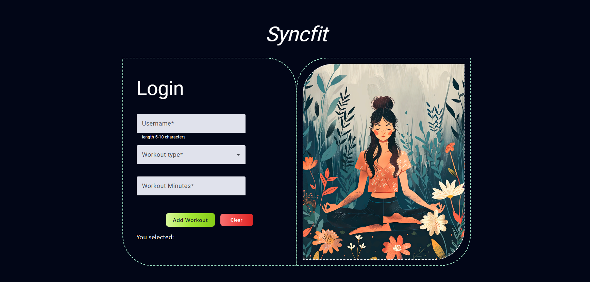

 SyncFit a Tracker of workouts/exercises  where you can join a group and you and your team can work towards your fitness goal together.

#plan  
The initial plan was to make a fitness personal webapp that can track my fitness which works as follows 

UI->FIGMA
FRONTEND->Angular
Style->Tailwind CSS
BACKEND->Express
DATABASE->Mongo DB

but eventually  did not end up following it as the Api for mongodb and others will be exposed it on github.

UI->FIGMA
FRONTEND->Angular
Style->Tailwind CSS
API->JSON FAKE API

instead i have used a JSON FAKE API
which does actually add data from the form to the table below .

fOLLOWING THE REQUIREMENTS 
++>CREATE A FORM
++>TABLE  FILTERS  can be applied 
++>TABLE DATA  MEMBERS CAN BE SEARCHED BY NAME 
++>API connection and retrieval

PROBLEMS TO OVERCOME
-->wont be able to fetch data until
json server --watch db.json
-->COULD NOT test properly as karma nad jasmine are deprecated 
-->Unit tests failures(new to testing in Angular)
-->Pagination glitechs for brave browser (tried testing on different browsers)

##future 
get it done with proper backend/frontend ,database.
unit test using  Jests
host cloud 

